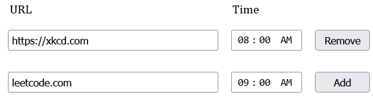

# daily_opener_extension

Firefox extension to open tabs daily, but only once.

Features:
* Users input urls to open in a new tab on a daily basis. The time after which the urls are opened is specified in the time column.
* Users can edit the set time even after clicking `Add` (changes saved automatically)
* If the browser is never opened until after the set time, the url will still open in a new tab if it was not opened already by the extension
* There may be up to a one minute window of error since the background script only checks if urls have been opened once per minute

Below is an example of how to fill out the popup.

## Small Note
This was my first extension and JavaScript project.
The extension can definitely be improved in both frontend and functionality.
Feel free to contribute!
