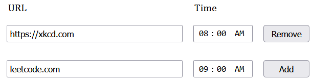

# daily_opener_extension

Firefox extension to open tabs daily, but only once.

Features:
* Users input urls to open in a new tab on a daily basis. The time after which the urls are opened is specified in the time column.
* Users can edit the set time even after clicking `Add` (changes saved automatically)
* If the browser is never opened until after the set time, the url will still open in a new tab if it was not opened already by the extension
* Uses browser alarms API for accurate, event-driven scheduling

Below is an example of how to fill out the popup.


## Small Note
This was my first extension and JavaScript project.
The extension can definitely be improved in both frontend and functionality.
Feel free to contribute!

## Generating a new version
Run the following, where `x.y.z` is the version number.
```bash
zip -r daily_opener-x.y.z.zip . \
  -x ".git/*" \
  -x "web-ext-artifacts/*" \
  -x ".*"
```

# Technical Details

## Storage Structure

The extension uses `browser.storage.local` to store scheduled URLs. The storage structure is:

- **Key**: URL string (e.g., `"https://example.com"`)
- **Value**: JSON stringified object with the following properties:
  - `set`: `number` - Time in minutes (60 × hours + minutes). For example, 9:30 AM = 570
  - `last`: `string` - ISO 8601 date string of when the URL was last opened
  - `timezone`: `string` - IANA timezone identifier (e.g., `"America/New_York"`, `"Europe/London"`). Defaults to browser's timezone if not specified

Example storage entry:
```json
{
  "https://example.com": "{\"set\":570,\"last\":\"2024-01-15T14:30:00.000Z\",\"timezone\":\"America/New_York\"}"
}
```
